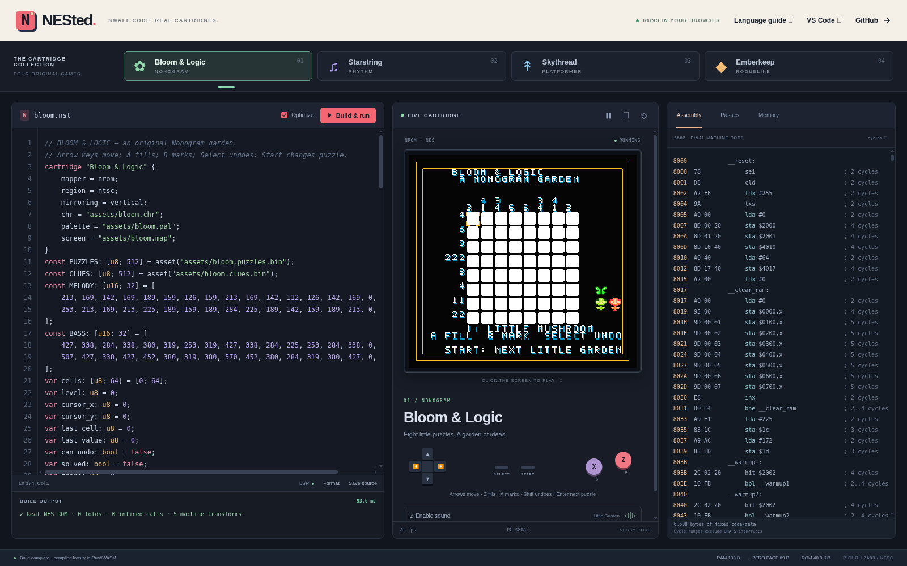
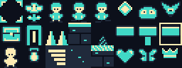

# NESted

**Small code. Real cartridges.** A NES-only language with a dependency-free Rust
compiler, a shared native/WASM language server, a VS Code extension, and a browser
workbench for source, compiler passes, 6502 assembly, and playable ROMs.



## Current milestone

The compiler and browser workbench execute **Bloom & Logic**, an original
Nonogram with eight puzzles, undo, pixel-art sprites, and a pulse/triangle
soundtrack. Starstring, Skythread, Emberkeep, and the VS Code packaging are in
progress. This status will be updated with each runnable milestone.

Compiler features already exercised in emulator tests include fixed-width
wrapping arithmetic, signed division, wide array indices, functions, loops,
inline assembly, static frame allocation, branch relaxation, and mapper-aware
NROM/MMC1/UxROM/MMC3 ROM generation. The language service provides diagnostics,
completion, hover, definitions, references, rename, formatting, and semantic
information using the same Rust code natively and in a browser worker.

## Build

Requires stable Rust, the `wasm32-unknown-unknown` target, Node 24+, and Python 3.

```sh
rustup target add wasm32-unknown-unknown
npm ci
npm run build
npm run dev
```

Open the Vite URL. Click the game screen to use arrows, Z/A, X/B, Shift/Select,
and Enter/Start. Sound starts after pressing **Enable sound**. Each game runs
from an actual compiled iNES ROM in the pinned
[Nessy](https://github.com/nathsou/nessy) Rust emulator.

```sh
cargo run --release -p nested-cli -- build games/bloom.nst --emit artifacts/bloom
cargo run --release -p nested-cli -- run games/bloom.nes 120
cargo test --workspace --locked
npm run typecheck
```

The compiler, assembler, JSON-RPC implementation, language services, and raw WASM
ABI have no external Rust dependencies. The emulator and its upstream
transitive dependencies are the only Rust dependency. Vite and the TypeScript 7
native preview are the only direct npm dependencies.

## Original assets



`scripts/generate-assets.py` reproducibly builds hand-authored NES 2-bpp sprites,
backgrounds, puzzle data, and four original compositions. Screenshots above
come from executing the compiled cartridge; the contact sheet shows asset source.

Read the [architecture](docs/architecture.md) for the compiler/runtime boundaries.
Cycle ranges in assembly are instruction costs; verified `@budget` contracts
cover acyclic unstalled instruction execution and explicitly exclude DMA,
interrupt latency, and PPU phase.
