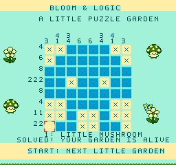
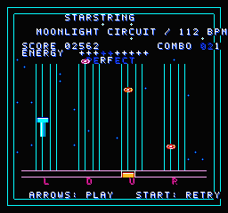
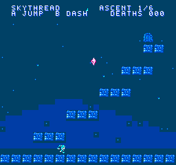
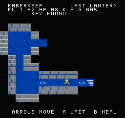

# NESted

**Small code. Real cartridges.** A NES-only programming language with an
embeddable Rust compiler, native/WASM LSP, VS Code extension, and browser
workbench. Every game runs from an actual compiled iNES ROM.

**[Open the playground →](https://nathsou.github.io/NESted/)** ·
[Language guide](docs/language.md) · [Design decisions](docs/design.md) ·
[Embed the compiler](crates/compiler/README.md) · [VS Code](extension/README.md)


## Four original cartridges

| Nonogram · NROM | Starstring · MMC3 |
|:---:|:---:|
|  |  |
| Sixteen uniquely solvable 8×8 puzzles, a clean grid, completed-clue feedback, held-button painting and undo. | Four lanes, taps/chords/sustains, three difficulties, combo scoring, ranks, pause/resume and music aligned to the notes. |

| Skythread · MMC1 | Emberkeep · UxROM |
|:---:|:---:|
|  |  |
| Six authored rooms, jump buffering, coyote time, variable jumps, wall jumps, eight-way dashes and collectible crystals. | Six connected generated floors, persistent exploration fog, wall-blocked lantern light, keys, potions, traps, bump combat and telegraphed enemies. |

Arrows move or hit lanes. **Z = A**, **X = B**, **Shift = Select**,
**Enter = Start**. Click the canvas for keyboard input, use the on-screen
controller, or connect a gamepad. Sound starts with **Enable sound**.

## Build and use

Requires stable Rust, Node 24+ and Python 3. TypeScript uses the native
**TypeScript 7 preview**, pinned in the lockfile.

```sh
rustup target add wasm32-unknown-unknown
npm ci
npm run build
npm run dev
```

The production bundle is `playground/dist/`. GitHub Actions verifies the Rust
compiler, compiled cartridges, WASM/native parity, LSP and production browser
before deploying that bundle to GitHub Pages.

```sh
cargo run --release -p nested-cli -- build games/bloom.nst --emit artifacts/bloom
cargo run --release -p nested-cli -- run games/bloom.nes 120
cargo run --release -p nested-cli -- fmt games/*.nst
cargo run -p nested-compiler --example embed
npm run package:extension
```

The last command creates a VSIX with the current host's native language server.
Install it with VS Code's **Extensions: Install from VSIX** command. CI also
provides a Linux x64 VSIX, compiler binary and ROMs as workflow artifacts.

## Compiler and tooling

Fixed-width modular arithmetic, explicit narrowing, fixed arrays, static frames,
proven indexing with a visible raw escape, exhaustive integer/bool `match`, inline 6502 assembly, byte-shared
interrupt storage and mapper-aware placement. NROM, MMC1, UxROM and MMC3 emit
real board layouts and bank-selection sequences. UxROM boots CHR RAM and uses
bus-conflict-safe writes.

The custom backend folds constants, simplifies algebra, inlines small pure
functions, eliminates constant branches/dead code, unrolls short loops, selects
immediates and shift/add multipliers, allocates zero-page storage, overlays
static frames, optimizes machine branches/loads, and relaxes long 6502 branches.
Seven inspectable passes include typed IR, optimized IR, machine lowering,
placement and final assembly. Listings retain source spans and instruction
costs. `@budget` verifies acyclic unstalled instruction bounds; DMA, interrupt
latency and PPU phase remain separate hardware contracts.

The shared LSP supplies diagnostics, completion, hover, definition, references,
rename, formatting, signatures, semantic tokens and type hints. The playground
uses the Rust service in a worker, with Ctrl+Space completion, F12 definition,
F2 rename and Shift+Alt+F formatting. Its emulator runs in another worker and
outputs actual NES APU audio. Assembly, intermediate passes and live RAM are
available alongside the editable source. A 44-pixel toolbar, cartridge dropdown,
draggable panes and Play/Code layouts keep the workbench compact; mobile tabs
keep Source, Game and Output accessible. Drafts are saved locally, and Reset
example can restore the previous draft. [See the mobile layout](docs/screenshots/mobile.png).

`nested-compiler` has **no third-party dependencies and no I/O**. Other projects
supply source and asset bytes and receive a ROM plus diagnostics and reports:

```rust
use nested_compiler::{compile, Assets, Options};
let cartridge = compile(
    "var ticks:u8=0; fn update(){ ticks += 1; }",
    &Assets::new(), Options::default(),
)?;
// cartridge.rom is a complete iNES image.
```

The emulator is the pinned [Nessy](https://github.com/nathsou/nessy) reusable Rust
crate, with its upstream dependencies. Vite and TypeScript 7 are the only direct
npm dependencies. The VS Code client uses built-in APIs without an LSP client
package; the WASM adapter uses a plain ABI without bindgen.

## Art, music and verification


The new [generated atlas](games/art/generated-atlas.png) is converted into
three-color NES pixel patterns for the climber, explorer, monsters, crystals
and props. Nonogram uses purpose-built grid tiles; the rhythm lanes and
platformer terrain are drawn explicitly for clear NES-scale silhouettes. `scripts/import-atlas.py` performs the import with ImageMagick;
normal builds use checked-in pattern data and need only Python's standard
library. `scripts/generate-assets.py` reproducibly encodes CHR, palettes,
nametables, puzzle clues, charts and four original chiptune compositions.
Screenshots show executing ROMs, not mocked game canvases.

```sh
cargo fmt --all -- --check
cargo test --release --workspace --locked
npm test
npm run test:browser
npm run screenshots                 # with npm run dev running
```

Tests execute compiler arithmetic against a modular reference, verify optimized
and unoptimized behavior, exercise mapper banks and assembly, solve a Nonogram
through controller input, complete the rhythm chart on all three difficulties
without misses, complete all six platformer rooms through controller routes,
and win all six dungeon floors through navigation, combat and potions. WASM
tests require byte-for-byte native ROM parity and non-silent APU output. Browser tests cover all four
cartridges, fresh-document LSP formatting, diagnostics, rebuilding, audio,
draft restoration, desktop resizing and mobile panes. Cartridge tests check
video-queue capacity and the eight-sprite scanline limit on every rendered
frame. The [refinement audit](docs/audit.md) records the issues and evidence.

v0.1 intentionally uses NTSC, fixed code banks and static scalar functions. It
has no heap, recursion, structs, references, module imports, banked functions,
PAL timing or battery saves yet. Queue capacity is 40 video writes per prepared
frame. The [language guide](docs/language.md) documents these contracts and the
[design notes](docs/design.md) explain their benefits and tradeoffs.
